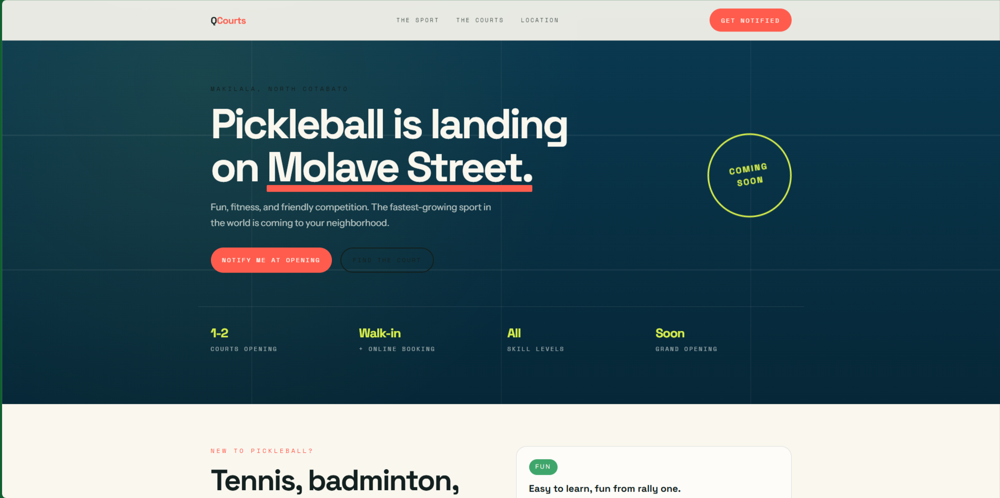
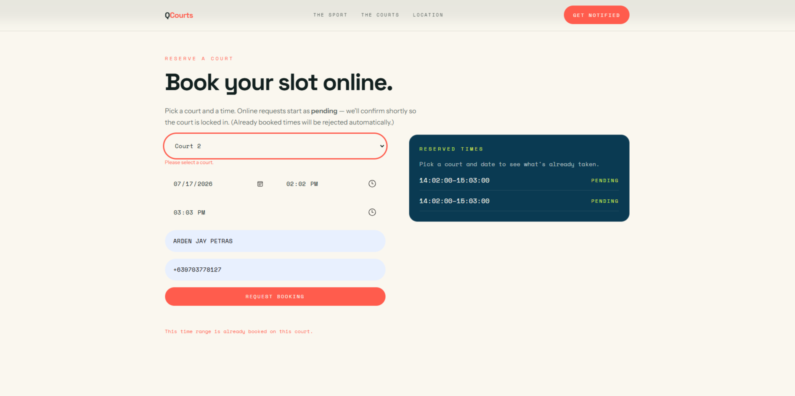
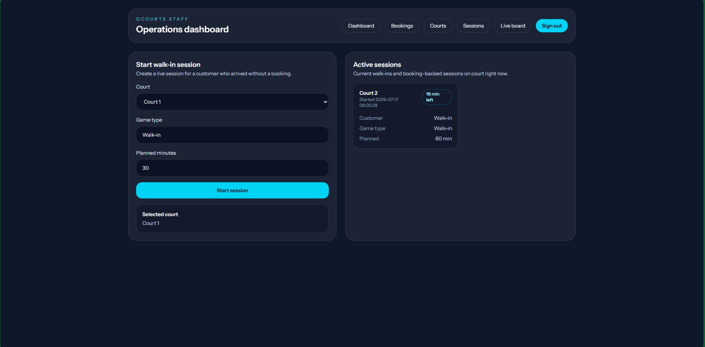
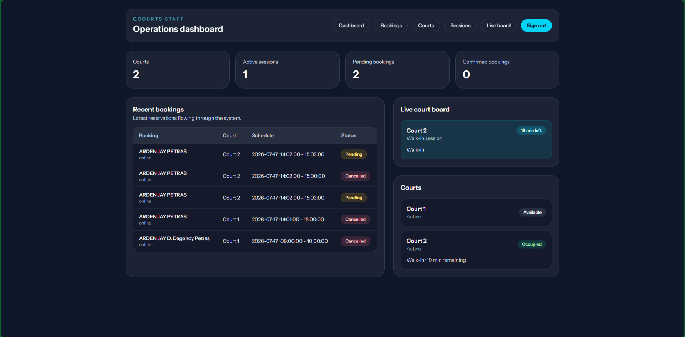
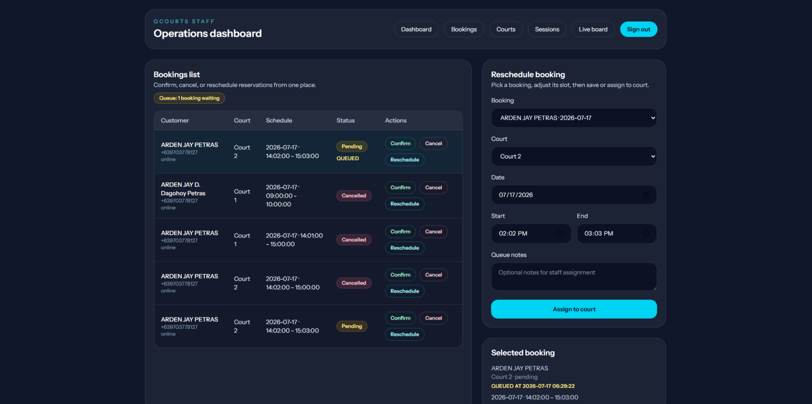

# QCourts Pickleball

A pickleball court booking system for Makilala, North Cotabato, Philippines — built for a single-location business opening with 1–2 courts, supporting both walk-in play and online booking.



## What it is

QCourts is the supporting software for a new pickleball business. It has three parts:

| Piece | What it does | Status |
|---|---|---|
| **Marketing website** | Static HTML/Tailwind landing page — sport explainer, location, online booking widget, notify-me form | Built |
| **Booking backend** | Laravel API — courts, bookings, live court sessions, conflict checking | Built |
| **Staff mobile app** | Flutter app for on-site staff to start/stop sessions, see the live court board, and log scores | Planned |




## Quick facts

- **Business**: QCourts Pickleball — Molave Street, Barangay Poblacion, Makilala (beside Victory Christian Schoolhouse, front of RHU Makilala)
- **Courts**: 1–2 at launch
- **Booking modes**: Walk-in (auto-confirmed) and online (starts pending, staff confirms)
- **Database**: PostgreSQL via Docker
- **Backend framework**: Laravel (scaffolded with the official Vue starter kit — Inertia + Vue 3 + TypeScript)
- **Website**: Static HTML/Tailwind, no build step, deployable to Netlify
- **Mobile app**: Flutter (not yet built)

## Features

- **Online booking** — customers pick a court, date, and time; requests start as `pending`
- **Walk-in booking** — staff creates a confirmed booking directly from the mobile app
- **Live session monitoring** — staff starts, ends, and scores sessions; the mobile app shows a real-time court board
- **Conflict prevention** — server-side checks prevent double-booking across both bookings and active sessions
- **Waiting list** — if a slot is unavailable, the booking is queued with a `queued_at` timestamp
- **Availability lookup** — the website widget calls `/api/courts/availability` to show which slots are open




## Tech stack

| Layer | Technology |
|---|---|
| Backend | Laravel 13, PHP 8.3+, PostgreSQL |
| API | REST JSON under `/api/*` |
| Frontend (website) | HTML, Tailwind CSS (CDN), vanilla JS |
| Frontend (admin, future) | Inertia.js + Vue 3 + TypeScript + shadcn/ui |
| Mobile (future) | Flutter/Dart |
| Infrastructure | Docker Compose (PHP app + Postgres 17) |
| Dev tooling | Vite, ESLint, Prettier, Pest, PHPStan |

## Getting started

### Prerequisites

- Docker and Docker Compose
- No local PHP or PostgreSQL install needed — everything runs in containers

### Run with Docker

```bash
docker compose up -d --build
```

This builds the PHP image, starts Postgres, runs migrations, seeds the courts, and serves the API on port 8000.

```bash
curl http://localhost:8000/api/courts   # verify the API is live
docker compose logs -f app               # watch the API logs
docker compose down                      # stop (keeps the database volume)
docker compose down -v                   # stop and wipe the database
```

### Environment

The `.env` file is pre-configured for Docker:

```
DB_CONNECTION=pgsql
DB_HOST=db
DB_PORT=5432
DB_DATABASE=qcourts
DB_USERNAME=postgres
DB_PASSWORD=Kashitekuto09
```

> **Note**: Running `php artisan` directly on the Windows host will not work — this PHP build does not include the `pdo_pgsql` driver. Use the Docker container for all backend commands.

## API endpoints

| Method | Endpoint | Purpose |
|---|---|---|
| `GET` | `/api/courts` | List active courts with current session status |
| `GET` | `/api/courts/availability` | Check slot availability for a date/time window |
| `GET` | `/api/bookings` | List bookings (filter by `date` and `court_id`) |
| `POST` | `/api/bookings` | Create a booking (online → pending, walk-in → confirmed) |
| `PATCH` | `/api/bookings/{id}` | Update status or reschedule (re-checks conflicts) |
| `DELETE` | `/api/bookings/{id}` | Cancel a booking (soft delete — sets `status: cancelled`) |
| `GET` | `/api/sessions/active` | Live court board — all active sessions with `minutes_remaining` |
| `POST` | `/api/sessions/start` | Start a session on a court |
| `PATCH` | `/api/sessions/{id}/end` | End a session (idempotent — rejects already-ended) |
| `PATCH` | `/api/sessions/{id}/score` | Update score during an active session |

See [qcourts-docs/05-api-reference.md](qcourts-docs/05-api-reference.md) for full request/response details.

## Project documentation

Detailed documentation lives in the [`qcourts-docs/`](qcourts-docs/) folder:

| Doc | What it covers |
|---|---|
| [`01-project-overview.md`](qcourts-docs/01-project-overview.md) | What QCourts is, who it's for, current status |
| [`02-requirements.md`](qcourts-docs/02-requirements.md) | Functional and non-functional requirements |
| [`03-system-architecture.md`](qcourts-docs/03-system-architecture.md) | How the three pieces fit together |
| [`04-data-model.md`](qcourts-docs/04-data-model.md) | Database schema and entity relationships |
| [`05-api-reference.md`](qcourts-docs/05-api-reference.md) | Backend API endpoint details |
| [`06-deliverables-roadmap.md`](qcourts-docs/06-deliverables-roadmap.md) | Phases, milestones, and what's done vs. pending |
| [`AGENTS.md`](qcourts-docs/AGENTS.md) | Instructions for AI coding agents |

The [`qcourts-backend/`](qcourts-backend/) folder contains a snapshot of the backend-specific source files and its own [README](qcourts-backend/README.md). The canonical backend code lives at the repository root.

## Roadmap

| Phase | Status |
|---|---|
| 1 — Marketing website | Done |
| 2 — Booking backend (core API) | Done |
| 3 — Booking widget on website | Done |
| 4 — Staff admin dashboard (Vue/Inertia) | Done |
| 5 — Mobile app (Flutter, staff-facing) | Planned |
| 6 — Launch readiness (auth, hosting, e2E test) | Planned |

See [qcourts-docs/06-deliverables-roadmap.md](qcourts-docs/06-deliverables-roadmap.md) for the full checklist.

## Out of scope (for now)

- Online payments
- Multi-location support
- Customer accounts / login on the website
- Tournament or league management
- Staff scheduling / payroll

## License

This project is proprietary software built for QCourts Pickleball.